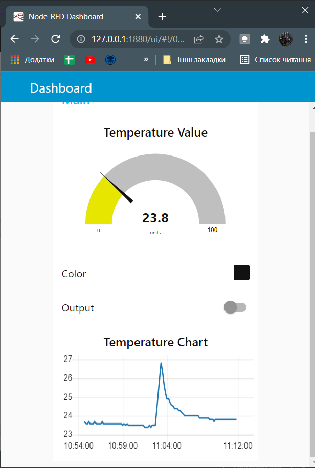
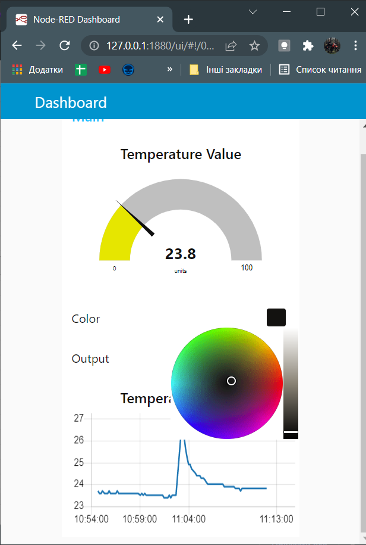
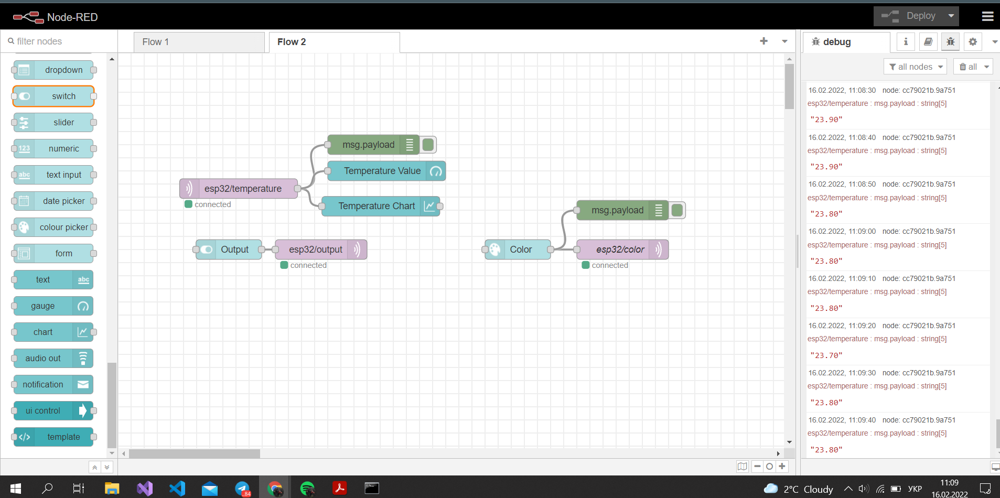
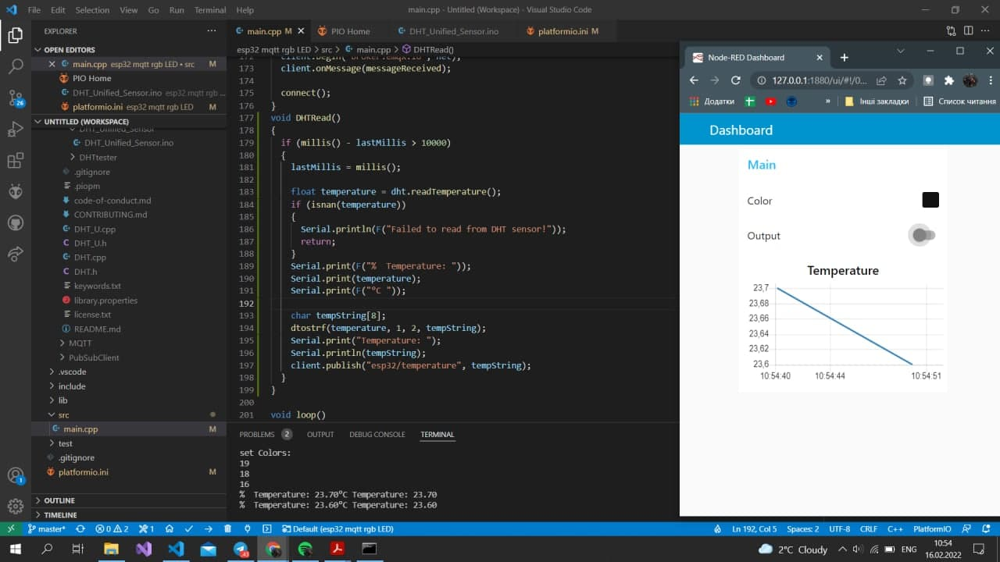
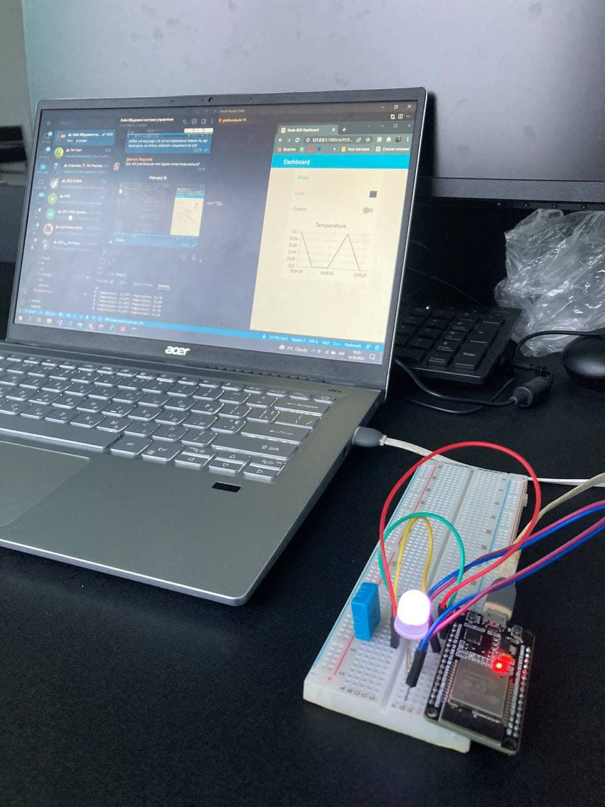

# ESP32 RGB LED with MQTT and NODE-RED
Here is my little uni project using MQTT on ESP32 board to color the RGB LED via Node-Red custom dashboard  

___

## Board code
To run the ESP32 just upload code from [main](src/main.cpp)  

## Node-Red Flow

I've created tiny UI for this project to display main values, here a some screens how it looks like  

  
  
  
  

The sources can be found here: [Node-Red](flows.json)
